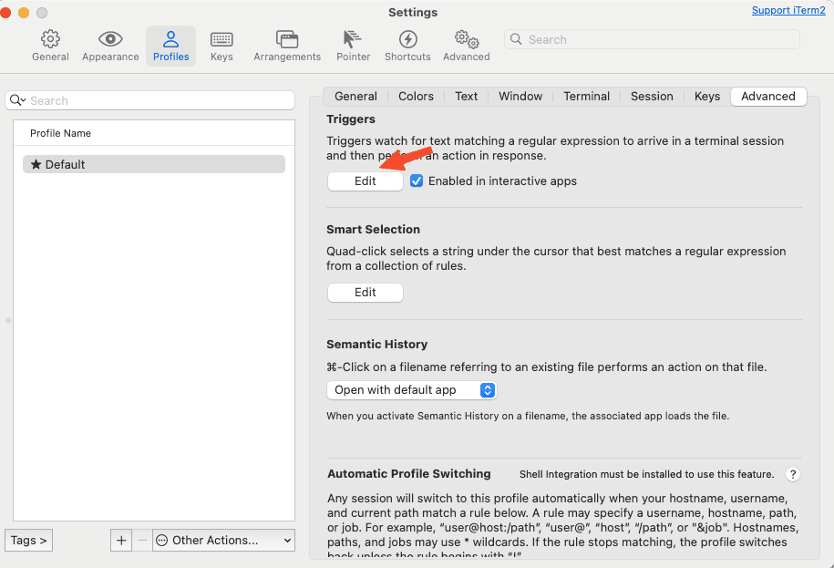
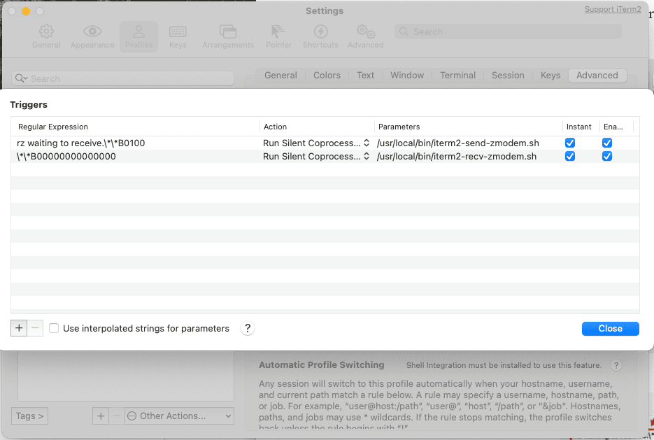

# Automatic file transfer in iTerm2 via ZModem

## Preserved from [https://grack.com/blog/2011/10/26/automatic-file-transfer-in-iterm2-via-zmodem/](https://grack.com/blog/2011/10/26/automatic-file-transfer-in-iterm2-via-zmodem/)
### Preserved with some updates/changes
`scp` is a great way to securely transfer files from computer to computer, but wouldn't it be nice if you could just automatically send files over the existing SSH connection you've already opened?

Back in the days of modem-based BBSes and dial-up machine access, file transfers were forced to run over the same TTY as your interaction with the system. A number of different solutions evolved for this, starting with the grandfather of transfer solutions, [XModem](https://en.wikipedia.org/wiki/XModem). Other transfer protocols evolved, some starting from the ground up like [Kermit](https://en.wikipedia.org/wiki/Kermit_%28protocol%29), while [YModem](https://en.wikipedia.org/wiki/YModem) and [ZModem](https://en.wikipedia.org/wiki/ZModem) build on the foundation of XModem.

The latest version of [iTerm 2](http://www.iterm2.com/#/section/home) added support for two features that were very interesting: Triggers, that match a regular expression to a line of text; and co-processes, that can feed input directly into a terminal. With these two features, we can add the ability to stream files to and from any server over an existing ssh session. As ZModem is most modern protocol with wide support (lrzsz is well-supported and packaged on both OSX and Linux), I'll show you how to use it to automate piggy-backed file uploads and downloads in your iTerm sessions.

### Setup

First of all, install `lrzsz` via brew. 
This will install the `sz` and `rz` binaries in `/usr/local/bin/` or `/opt/homebrew/bin`:

```
your mac:~ user$ brew install lrzsz
```

Grab the scripts from [here](https://github.com/proteus-russ/configuration/iterm), and save them in `/usr/local/bin/`.


Next, we'll add a Triggers to your iTerm 2 profile that will trigger on the signature of the `rz` and `sz` commands. 




```
Regular expression: rz waiting to receive.\*\*B0100
Action: Run Silent Coprocess
Parameters: /usr/local/bin/iterm2-send-zmodem.sh
```


```
Regular expression: \*\*B00000000000000
Action: Run Silent Coprocess
Parameters: /usr/local/bin/iterm2-recv-zmodem.sh
```

### Receiving files from the server

To receive a file on your server, type the following at a shell prompt:

```
# rz
```

A file-picker dialog will then pop up asking you for the file to send. Once you choose the file to send, it will automatically transfer the file across your existing console session.

### Sending files to the server

To send files from your server to your desktop, type the following:

```
# sz file1 file2 file3 /folder/file*
```

A folder picker will show up, asking where you want to drop the files. If you send multiple files, they will all appear in this folder.

### Wrap-up

This is a pretty rough first pass at this, but the shell scripts are [available on github](https://github.com/mmastrac/iterm2-zmodem) if you've got ideas for improvement.

Follow me on Twitter: [@mmastrac](https://twitter.com/mmastrac)

[Read full post](https://grack.com//blog/2011/10/26/automatic-file-transfer-in-iterm2-via-zmodem)

### Notes

The mmastrac iterm repo no longer exists. This is a copy of the original blog post and repo contents.
